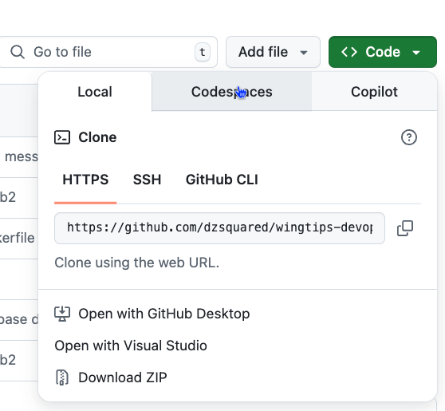
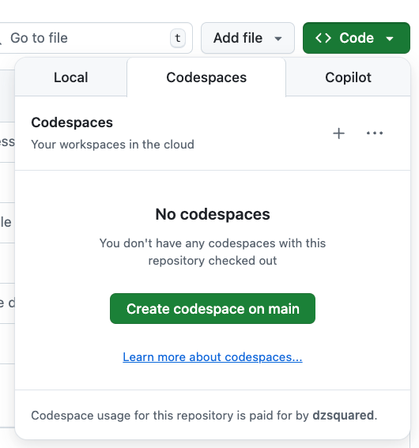

# LAB0: Prerequisites and setup

This folder (LAB0) contains the SQL project for the initial state of the Wingtips database provided to students at the beginning of the series of labs. 

If you are performing the labs as part of a workshop, the instructor may provide you with a student connection string to the Wingtips database such that you can immediately start **LAB1**.

If you are performing the labs as part of a self-paced learning experience, you may need to deploy the initial state of the Wingtips database yourself. The instructions for deploying the initial state of the Wingtips database are provided below.

## Prerequisites

- VS Code
- the mssql and SQL Database Projects extensions for VS Code
- .NET SDK 8.0+
- SqlPackage CLI

To install the SqlPackage CLI, run the following command after installing the .NET SDK:

```bash
dotnet tool install -g Microsoft.SqlPackage
```

### Codespaces

If you are unable to install the .NET SDK on your machine, using a GitHub Codespace for Lab 1 is recommended. As a cloud-based development environment, Codespaces provide a VS Code environment in the  Codespaces are preconfigured with the .NET SDK and you can install the SqlPackage CLI using the command above as well as the mssql and SQL Database Projects extensions for VS Code.


Create a Codespace from your GitHub repository by clicking the green **Code** button and selecting **Create Codespace on main**. This will create a new Codespace in your GitHub repository.





Once in a Codespace, you can install the mssql and SQL Database Projects extensions for VS Code by clicking on the Extensions icon in the left-hand menu and searching for the extensions.

Finally, you're ready to work on the labs from the Codespace.


## Setup a free database

Using the [Azure SQL Database free offer](https://learn.microsoft.com/en-us/azure/azure-sql/database/free-offer), create a free Azure SQL Database in your Azure subscription.

Be sure to enable SQL authentication and set the server admin login and password. The server admin login and password will be used to connect to the database to deploy the initial state of the Wingtips database.

## Deploy the initial state of the Wingtips database

The initial state of the Wingtips database is deployed to an Azure SQL Database or SQL Server instance. The initial state of the database includes a `db_owner` user with the username **student** and the password to be set through the SQLCMD variable `StudentPassword`.

Download the [Wingtips-initial DACPAC file](Wingtips-initial.dacpac) from the repository. The DACPAC file is located in the LAB0 folder.

Obtain the admin connection string for the Azure SQL Database or SQL Server instance. The connection string should look similar to:

```text
Server=tcp:<server>.database.windows.net,1433;Initial Catalog=<database>;Persist Security Info=False;User ID=<admin_user>;Password=<admin_password>;MultipleActiveResultSets=False;Encrypt=True;TrustServerCertificate=False;Connection Timeout=30;
```

Using the connection string and a new strong password for the student user, run the following command to deploy the initial state of the Wingtips database:

```bash
sqlpackage /a:publish /sf:"modules/LAB0/Wingtips-initial/bin/Debug/Wingtips-initial.dacpac" /tcs:"<connection string here>" /v:StudentPassword=<new student password>
```

## Next lab

[LAB 1: Participants configure a simple CI/CD pipelines for a sample SQL project](../LAB1/README.md)
