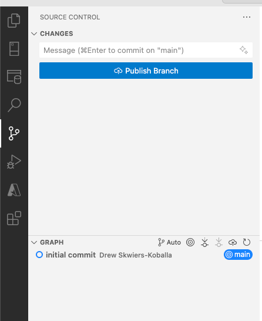
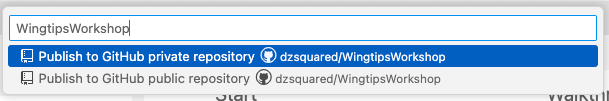
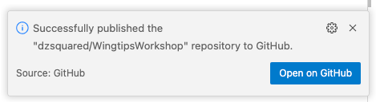

# LAB 1: Participants configure a simple CI/CD pipelines for a sample SQL project

**Overview:**
- 1.1: Create a project from an existing database
- 1.2: Create a pipeline to publish the project to the database
- 1.3: Create a pipeline to build the project and run code analysis
- 1.4: Deploy our changes to the database

## Workshop prerequisites

If your instructors have provided you with a connection string to the Wingtips database, you are ready to start the workshop. If you are doing this workshop as part of a self-paced learning experience, you will need to deploy the initial state of the Wingtips database yourself. The instructions for deploying the initial state of the Wingtips database are provided in [**LAB0**](../LAB0/README.md).

You must have the following installed on your machine:

- Visual Studio Code
- the mssql and SQL Database Projects extensions for VS Code
- .NET SDK 8.0+

## 1.1 Create a project from an existing database

### Setup the project locally

1. Connect to the Azure SQL Database in VS Code and open a new folder for this workshop. Name the folder `WingtipsWorkshop` or something else memorable like `DevOpsWorkshopMarathon`.
2. Using the SQL projects extension, select **Create Project from Database** in the upper right ellipsis menu.
3. Follow the prompts to create a new SQL project named `Wingtips` from the database in a folder called `Wingtips` in the workshop folder.
4. From the SQL projects extension, right-click on the **Wingtips** project and select **Build** to build the project. This will create a `.dacpac` file in the `bin/Debug` folder of the project. The `.dacpac` file is a compiled version of the SQL database model.

5. Since we don't want to include files like a `.dacpac` in our future git repository, we need to add a `.gitignore` file to the project. Open the **Terminal** in VS Code (View menu > Terminal or Ctrl+`), and run the following command to create a `.gitignore` file in the workshop folder:
   ```bash
   dotnet new gitignore
   ```

### Push the project to a new private GitHub repository

1. From the **Source Control** view in VS Code, initialize a git repository and commit the entire project to the repository with a commit message like "initial commit".
2. The commit button in the Source Control view will now display **Publish Branch**. Click the button to publish the branch to a new private GitHub repository.



3. If you are prompted to sign in to GitHub, follow the prompts to sign in. 
4. Select the private option for the repository, adjusting the name if you want to.



5. The repository will be created and the branch will be pushed to the new repository. A notification will appear in the bottom right corner of VS Code with a link to the new repository which will also be available in the GitHub website.



## 1.2 Create a pipeline to publish the project to the database

In this section we're going to create a GitHub Actions pipeline to publish the SQL project to the database from templates provided by GitHub, all from the web browser. Later on in our workshop we'll edit pipelines locally in VS Code.

1. In the GitHub repository, select **Actions**.
2. Search for the ".NET" template and select it to configure the pipeline, which starts with this template code:
  ```yml
    # This workflow will build a .NET project
    # For more information see: https://docs.github.com/en/actions/automating-builds-and-tests/building-and-testing-net
    
    name: .NET
    
    on:
      push:
        branches: [ "main" ]
      pull_request:
        branches: [ "main" ]
    
    jobs:
      build:
    
        runs-on: ubuntu-22.04
    
        steps:
        - uses: actions/checkout@v4
        - name: Setup .NET
          uses: actions/setup-dotnet@v4
          with:
            dotnet-version: 8.0.x
        - name: Restore dependencies
          run: dotnet restore
        - name: Build
          run: dotnet build --no-restore
        - name: Test
          run: dotnet test --no-build --verbosity normal
  ```
  
3. Rename the pipeline file to `publish.yml`.
4. Change the workflow to run only on manual trigger:
  ```yml
    on:
      workflow_dispatch:
  ```
  Remove the `push` and `pull_request` events, which trigger the pipeline on every commit and pull request to the specified branches.
5. Remove the `Test` step in the pipeline and modify the pipeline name in the YAML to "Deploy SQL project".
6. Modify the `Restore` and `Build` steps to build the SQL project in the `Wingtips` folder by specifying the project file:
  ```yml
    - name: Restore dependencies
      run: dotnet restore Wingtips/Wingtips.sqlproj
    - name: Build
      run: dotnet build Wingtips/Wingtips.sqlproj --no-restore
  ```
6. Add a step to the pipeline that uses **SqlPackage** to publish the `.dacpac` to the database after the SQL project has been built:
  ```yml
    - name: Publish SQL project
      run: |
        SqlPackage /Action:Publish /SourceFile:Wingtips/bin/Debug/Wingtips.dacpac /TargetConnectionString:${{ secrets.SQL_CONNECTION_STRING }}
  ```
  Note that the path to the source file is relative to the working directory of the pipeline, which starts at the root of the repository, and the name of the `.dacpac` file defaults to the name of the project.
7. Commit the changes to the pipeline file.
8. Add a secret to the GitHub repository named `SQL_CONNECTION_STRING` with the connection string to the Azure SQL Database. Secrets are used to store sensitive information in GitHub Actions and are set in the repository settings under "secrets and variables" and "actions".
9. We won't run this pipeline just yet since we have no changes to apply to the database. We'll run it later after we make some changes to the project.

<details>
<summary>Completed publish pipeline (expand to check your work)</summary>

```yml
    # This workflow will build a .NET project
    # For more information see: https://docs.github.com/en/actions/automating-builds-and-tests/building-and-testing-net
    
    name: Deploy SQL project
    
    on:
      workflow_dispatch:
    
    jobs:
      build:
    
        runs-on: ubuntu-22.04
    
        steps:
        - uses: actions/checkout@v4
        - name: Setup .NET
          uses: actions/setup-dotnet@v4
          with:
            dotnet-version: 8.0.x
        - name: Restore dependencies
          run: dotnet restore Wingtips/Wingtips.sqlproj
        - name: Build
          run: dotnet build Wingtips/Wingtips.sqlproj --no-restore
        - name: Publish SQL project
          run: |
            SqlPackage /Action:Publish /SourceFile:Wingtips/bin/Debug/Wingtips.dacpac /TargetConnectionString:${{ secrets.SQL_CONNECTION_STRING }}
```
</details>


## 1.3 Create a pipeline to build the project and run code analysis

In this section we're going to leverage SQL code analysis to provide ongoing feedback on the quality of the SQL code in the project. The pipeline will run on every commit to the main branch. When we use the pipeline on pull requests, it will provide feedback on the quality of the code before it is merged into the main branch and acts as a CI (continuous integration) pipeline.

1. In VS Code, sync our project with the remote GitHub repository. A folder `.github` will be created in the root of the project with a `workflows` folder inside it.
2. In the `.github/workflows` folder, create a new file named `build-codeanalysis.yml` with the following content:
  ```yml
    name: Build SQL project with code analysis
    
    on:
      push:
        branches: [ "main" ]
        paths:
          - 'Wingtips/**'
      pull_request:
        branches: [ "main" ]
        paths:
          - 'Wingtips/**'
    
    jobs:
      build:
        runs-on: ubuntu-22.04
    
        steps:
        - uses: actions/checkout@v4
        - name: Setup .NET
          uses: actions/setup-dotnet@v4
          with:
            dotnet-version: 8.0.x
        - name: Build
          run: dotnet build Wingtips/Wingtips.sqlproj /p:RunSqlCodeAnalysis=true
  ```

  This pipeline will run on every commit to the main branch and pull requests against main.
3. We'll test our new pipeline with a new stored procedure. In VS Code, switch to a new branch named `new-venue`.
4. In the `Wingtips` project folder, add a new file in `dbo/StoredProcedures` named `NewVenue.sql`. Add the following content to the file:

  ```sql
    -- Creates a new Venue
  CREATE PROCEDURE [dbo].[NewVenue]
      @VenueId  INT,
      @VenueName NVARCHAR(128),
      @VenueType NVARCHAR(30) = 'multipurpose',
      @PostalCode NVARCHAR(20) = '98052',
      @CountryCode CHAR(3) = 'USA'
  AS
      IF @VenueId IS NULL
      BEGIN
          RAISERROR ('Error. @VenueId must be specified', 11, 1)
          RETURN 1
      END
  
      IF @VenueName IS NULL
      BEGIN
          RAISERROR ('Error. @VenueName must be specified', 11, 1)
          RETURN 1
      END
  
  
      -- Insert Venue
      INSERT INTO [dbo].Venues
          ([VenueId],[VenueName],[VenueType],[AdminEmail],[CountryCode], [PostalCode])         
      VALUES
          (@VenueId, @VenueName,@VenueType,'admin@email.com',@CountryCode, @PostalCode)
  
  RETURN 0
  ```
5. Commit the new stored procedure to the `new-venue` branch and push the branch to GitHub.
6. In GitHub, create a pull request from the `new-venue` branch to the `main` branch.
7. In the pull request, select the **Checks** tab and see that the pipeline is running.
8. When the pipeline completes, select the **Details** link to see the results of the code analysis.
<details>
<summary>Code analysis results (expand to check your work)</summary>

The code analysis returns 1 warning:

```txt
Build succeeded.

/Users/Shared/CodeRepos/dzsquared/WingtipsWorkshop/Wingtips/dbo/StoredProcedures/NewVenue.sql(27,20,27,20): StaticCodeAnalysis warning SR0014: Microsoft.Rules.Data : Data loss might occur when casting from NVarChar(128) to NVarChar(50). [/Users/Shared/CodeRepos/dzsquared/WingtipsWorkshop/Wingtips/Wingtips.sqlproj]
    1 Warning(s)
    0 Error(s)
```

</details>

9. Based on the code analysis results, we realize that our stored procedure `dbo.NewVenue` is using the right size for the VenueName parameter (128 characters) but the table its being inserted into is using a smaller size. Let's fix that by modifying the size of the `VenueName` column in the `dbo.Venues` table to 128 characters.
10. In the `Wingtips` project folder, open the file `dbo.Tables/Venues.sql` and change the size of the `VenueName` column from 50 to 128 characters:

```sql
CREATE TABLE [dbo].[Venues] (
    [VenueId]        INT            NOT NULL,
    [VenueName]      NVARCHAR (50)  NOT NULL,
  ...
```

11. Commit the change to the `new-venue` branch and push the change to GitHub.
12. In GitHub, the pipeline will automatically run again and this time the code analysis will pass.
13. In GitHub, merge the pull request to the `main` branch.

## 1.4 Deploying our changes to the database

In this section we're going to deploy the changes we made in the `new-venue` branch to the database using the publish pipeline we created earlier. Our last step from the previous section was to merge the changes into the main branch, so when we run the publish pipeline from the main branch, it will include the changes we made in the `new-venue` branch.

The changes we made added a new stored procedure and changed a column in a table. We don't need to worry about how to deploy these changes to the database because the publish pipeline will automatically generate a script to deploy the changes when it uses SqlPackage to publish the project.

1. In GitHub, select the **Actions** tab and select the **Deploy SQL project** pipeline.
2. Click the **Run workflow** button to run the pipeline manually.
3. Once the pipeline has completed, click on the **Publish SQL project** step to see the output of the SqlPackage command.
4. Connect to the Azure SQL Database in VS Code or SSMS to verify that the stored procedure and table change have been deployed.

## Next lab

[LAB 2: Participants deploy SQL projects to different platforms](../LAB2/README.md)

