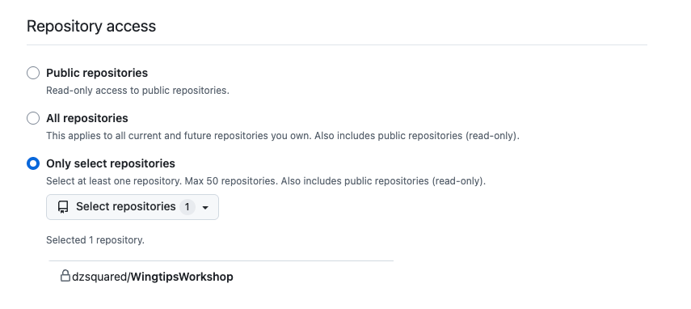
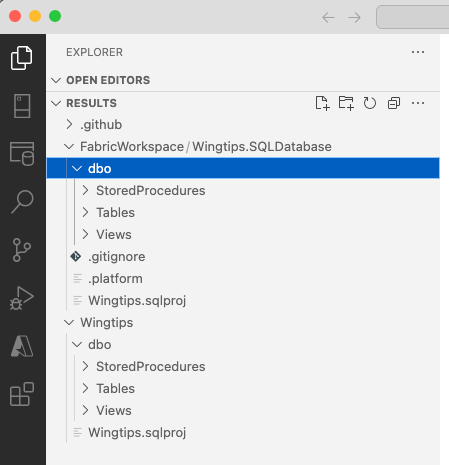

# LAB 2: Participants deploy SQL projects to different platforms

**Overview:**
- 2.0: Update your local repository from GitHub
- 2.1: Create a pipeline for SQL Server 2022
- 2.2: Create a SQL database in Fabric and use source control integration

## 2.0 Update your local repository from GitHub

Before we can make more changes to our project, we need to make sure our local repository is up to date with the latest changes from GitHub.

1. Switch the branch in VS Code to `main`.
2. In the terminal, run the following command to update your local repository with the latest changes from GitHub:
  ```bash
  git pull origin main
  ```

## 2.1 Create a pipeline for SQL Server 2022

SQL projects are a shared format across the SQL family, including using the same SqlPackage publish tool. The same SQL project we've been working on for Azure SQL Database will work for SQL Server with minor modifications.

In this example, we're going to create a pipeline that runs a test deploy of the SQL project, using a SQL 2022 container inside the pipeline. The same concepts we use to run the deployment in a container can be used to run the deployment on a SQL Server instance.

1. In the `.github/workflows` folder, create a new file named `build-sql2022.yml` with the following content:
  ```yml
  name: Test SQL project with SQL Server 2022

  on:
    workflow_dispatch:
    push:
      branches: [ "main" ]
      paths:
        - 'Wingtips/**'
    pull_request:
      branches: [ "main" ]
      paths:
        - 'Wingtips/**'
     
  jobs:
    build:
      runs-on: ubuntu-22.04
      # service/sidecar container for sql
      services:
        mssql:
          image: mcr.microsoft.com/mssql/server:2022-latest
          env:
            ACCEPT_EULA: 1
            SA_PASSWORD: ${{ secrets.CONTAINER_SQL_PASSWORD }}
          ports:
            - 1433:1433

      steps:
        - uses: actions/checkout@v4
        - name: Setup .NET
          uses: actions/setup-dotnet@v4
          with:
            dotnet-version: 8.0.x
        - name: Restore dependencies
          run: dotnet restore wingtips/wingtips.sqlproj
        - name: Build
          run: dotnet build wingtips/wingtips.sqlproj --no-restore
        - name: 'wait for sql container to be ready'
          run: |
            set +o pipefail +e
            for i in {1..60};
            do
                sqlcmd -S localhost -U sa -P ${{ secrets.CONTAINER_SQL_PASSWORD }} -d master -Q "select getdate()"
                if [ $? -eq 0 ]
                then
                    echo "sql server ready"
                    break
                else
                    echo "not ready yet..."
                    sleep 1
                fi
            done
            set -o pipefail -e

        - name: Publish SQL project
          run: |
            SqlPackage /Action:Publish /SourceFile:Wingtips/bin/Debug/Wingtips.dacpac /TargetConnectionString:"Data Source=localhost,1433;Database=Wingtips;User ID=sa;Password=${{ secrets.CONTAINER_SQL_PASSWORD }};TrustServerCertificate=True;" /p:AllowIncompatiblePlatform=true
   ```
  The SqlPackage command is the same as the one we used for Azure SQL Database, but with the `AllowIncompatiblePlatform` flag allows us to deploy to a different platform than what the project targets.
2. Commit the file to the `main` branch and push it to GitHub.
3. In GitHub, navigate to the repository settings and select the `Secrets and variables` tab.
4. Click on the `Actions` tab and create a new secret named `CONTAINER_SQL_PASSWORD` with a value of your choice (like `Password123` or `SqlProjectsAreC00l`). This password will be used to connect to the SQL Server container. The password must meet the SQL Server password complexity requirements (3 of the 4 character sets, over 8 characters long).
5. In GitHub, navigate to the `Actions` tab and select the `Use SQL project with SQL Server 2022` workflow.
6. Click the `Run workflow` button to run the workflow manually.
7. Once the workflow has completed, click on the `Publish SQL project` step to see the output of the SqlPackage command.
8. In the output, you should see a message indicating that the deployment was successful.

## 2.2 Create a Fabric SQL Database and use source control integration

The Fabric platform provides integrated CI/CD capabilities that can be used in addition to SQL projects through GitHub Actions or Azure DevOps pipelines. The Fabric lifecycle management source control and deployment pipelines extend to additional item types (such as PowerBI reports and notebooks) and provide a more integrated experience for managing the lifecycle of Fabric items. For SQL database in Fabric, the source control integration is based on SQL database projects, so development processes created for SQL Server/Azure SQL Database can often be reused with SQL database in Fabric.

In this exercise, you will create a Fabric SQL database and use source control integration to navigate the lifecycle of the database from initial creation to updating the project in VS Code. We will use the GitHub integration for Fabric, which allows you to connect a Fabric workspace to a GitHub repository.

*If you are doing this workshop as a self-paced lab, you may not have the GitHub integration enabled on your Fabric tenant. Check with your administrator to see if the integration is available before completing section 2.2.*

### Connect a workspace to a GitHub repository

1. In GitHub, create a fine-grained [access token](https://github.com/settings/personal-access-tokens/new) with read and write access to your workshop repository. These are created in GitHub **settings** under **Developer settings**. **Fine-grained tokens** are located under **Personal access tokens**. The token should be given **repository access** to only the repository you created for this workshop. Expand the **repository permissions** section and select **Read and write** for the **contents** permission.




2. Click **Generate token** and copy the token to your clipboard before pasting it into a temporary text file. You will not be able to see the token again after you leave the page, so make sure to copy it somewhere safe for the next few steps.
3. In Fabric, create a new workspace.
4. In the workspace, open settings and connect the workspace to the GitHub repository. Use the `main` branch and  (https://learn.microsoft.com/fabric/cicd/git-integration/git-get-started?tabs=github%2CGitHub%2Ccommit-to-git) **set the Git folder to FabricWorkspace**.

5. In the workspace, create a new SQL database named "Wingtips". The SQL editor will open automatically and present several options for working with the database. However, we want to use the source control integration to initialize our database with a bunch of objects, so return to the workspace view.

6. Open the source control panel in the workspace and commit the empty database. This process may take a few minutes, but when it completes, you should see a message indicating that the commit was successful.

7. Navigate to the GitHub repository. You should see a new folder named `FabricWorkspace` and inside is a folder named `Wingtips.SQLDatabase`. This folder contains the **object definition** files for the Fabric item, which are primarily a SQL project for a SQL database in Fabric. The folder also contains a `.platform` file

### Add objects to the SQL database in Fabric source control definition

1. Update your local repository/folder with the latest changes from GitHub. In VS Code, run the following command in the terminal:
  ```bash
  git pull origin main
  ```

2. You should see the new `FabricWorkspace` folder in your VS Code file explorer. We will copy the objects from Wingtips SQL project into this folder by copying the **dbo** folder from the **Wingtips** folder into the **Wingtips.SQLDatabase** folder. Leave the `Wingtips.sqlproj` file and the `.platform` file as-is.



3. We'd like to create the objects from the SQL project in Fabric, which we can do by updating the database from source control. Commit the local changes and push them to the GitHub repository.
4. In Fabric, open the source control pane. It may take a few moments for the browser to show that new changes are available, but click the **Update all** button when it is enabled. Behind the scenes, the SQL project is being built and deployed from source control, updating our Fabric Wingtips database.
5. When the Fabric notification appears that the update has completed, open the SQL editor in Fabric and expand the object explorer to confirm the database objects are present.

### Modify the database in Fabric and update source control

With our database created and the objects in source control, we can now work with the source control integration bi-directionally (in both directions).

1. From the Fabric SQL editor, open a new query window and run the following SQL to modify the database:

```sql
CREATE INDEX IX_Customers_PostalCode ON Customers (PostalCode);
GO
```

2. In the Fabric workspace, open the source control panel to commit the changes.
3. Navigate to the `GitHub` repository and open the `FabricWorkspace/Wingtips.SQLDatabase` folder. When you select the **History** view, you should see the commit you just made to the database. The commit message will be the same as the one you entered in Fabric.

### Branch and merge changes

With the bi-directional source control integration, you can create changes in different branches of the repository and merge them into the branch associated with the Fabric workspace. Creating changes in another branch can come from yet another Fabric workspace or from a local SQL project (you or someone else on your team). You can also use the GitHub pull request process to review and approve changes before they are merged into the branch associated with the Fabric workspace. This allows you to use the same GitHub workflows you would use for any other project, but with the added benefit of being able to easily deploy the SQL project to Fabric.

1. Update your local repository/folder with the latest changes from GitHub. In VS Code, run the following command in the terminal:
  ```bash
  git pull origin main
  ```

2. In VS Code, click where the editor shows the current branch name **main** (in the bottom left corner) and select **Create new branch**. Name the new branch `view-music-venues`.

3. We're going to create a new view for "Music Venues" for our SQL database in Fabric, which presents a list of venues where the venue type is in one of several different categories. Locate the `Views` folder for the `dbo` schema in the `FabricWorkspace` directory. In the `Views` folder create a new file named `MusicVenues.sql` with the following content:

```sql
CREATE VIEW dbo.MusicVenues
AS
SELECT v.VenueId
  , v.VenueName
  , v.VenueType
  , v.AdminEmail
  , v.AdminPassword
  , v.PostalCode
  , v.CountryCode
  , v.RowVersion
FROM dbo.Venues v
LEFT JOIN dbo.VenueTypes vt
ON v.VenueType = vt.VenueType
WHERE vt.EventTypeShortName IN ('Concert', 'Session', 'Opera');
```

4. In the SQL database projects extension, identify which Wingtips project is the project for SQL database in Fabric by one of the following methods:
- hover over the project name and look for the `FabricWorkspace` folder in the path
- right-click the project and select **Change target platform**. The target platform should mention Fabric.

5. Right-click the Fabric Wingtips project and select **Build**. This will build the SQL project and validate the entire SQL database model.

6. From the **Source control** panel, commit the new view to the `view-music-venues` branch. The commit message should be something like "Add MusicVenues view".

7. Push the changes to GitHub.

8. Open the GitHub repository and create a pull request from the `view-music-venues` branch to the `main` branch. The pull request should show the new view as a change in the `FabricWorkspace/Wingtips.SQLDatabase/Views` folder.

9. We could have configured a CI pipeline to run code analysis on the SQL project for our SQL database in Fabric, but for this example we will have to trust our changes are correct. Since you know how easy it was to setup a CI code analysis pipeline for SQL projects (lab 1.3), I'm sure you will leverage that in your own projects.

10. In the pull request, click the **Merge** button to merge the changes into the `main` branch. This brings the new view into the `main` branch, but the Fabric workspace is still using the old version of the database. We need to update the Fabric workspace to use the new definition of the database now in source control.

11. In Fabric, open the source control panel and click the **Update all** button to update the Fabric workspace with the new definition of the database from source control. This will build and deploy the SQL project from the `main` branch to the database to Fabric.

12. Once the update is complete, open the SQL editor in Fabric and expand the object explorer to confirm the new view is present.

## Next lab

[LAB 3: Participants implement advanced DevOps practices in their SQL projects](../LAB3/README.md)
