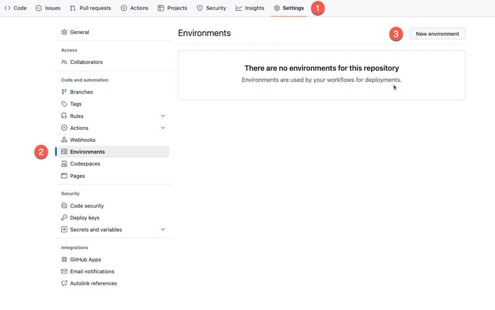
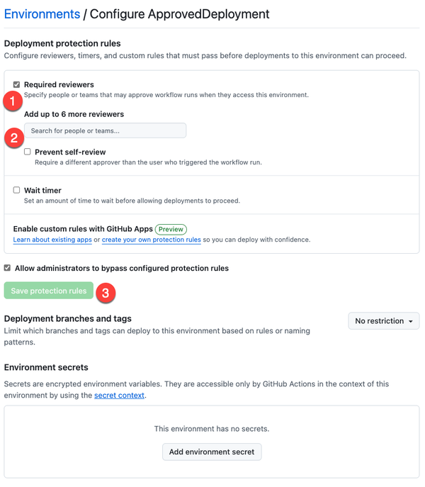
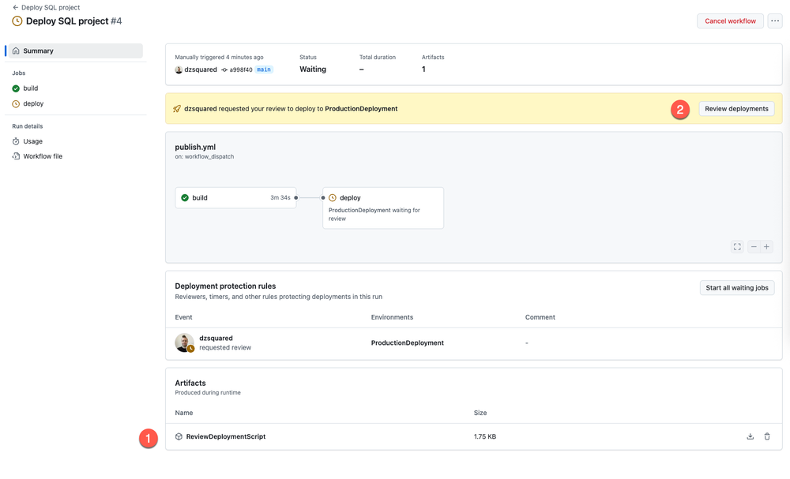
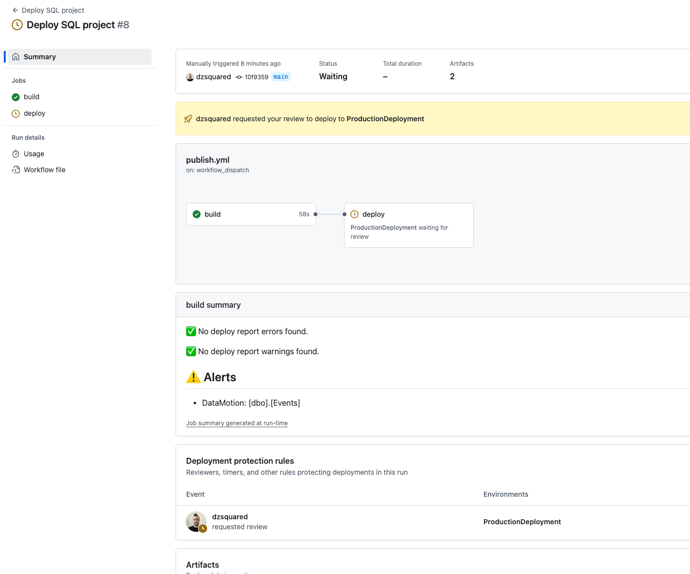

# LAB 3: Participants implement advanced DevOps practices in their SQL projects

**Overview:**
- 3.1: Static data management through a post-deployment script
- 3.2: Deploy script and environment approvals
- 3.3: Deploy report and summarizing dangers

## 3.1 Static data management through a post-deployment script

In this section we're going to tackle the need for specific data to always be present in the `Countries` table and the `VenueTypes` table.

1. Return to the original workshop folder in VS Code.
2. In the SQL projects extension, right-click on the Wingtips project and select **Add Post-Deployment Script**.
3. Name the post-deployment script `StaticData`.
4. In the post-deployment script, add the following code:

```sql
  MERGE INTO [dbo].[Countries] as [target]
  USING (VALUES
      ('USA', 'United States','en-us')
  ) as [source] ([CountryCode],[CountryName],[Language])
  ON [target].[CountryCode] = [source].[CountryCode]
  WHEN MATCHED THEN
      UPDATE SET [target].[CountryName] = [source].[CountryName], [target].[Language] = [source].[Language]
  WHEN NOT MATCHED BY TARGET THEN
      INSERT
      ([CountryCode],[CountryName],[Language])
  VALUES
      ([CountryCode],[CountryName],[Language]);
  GO


  MERGE INTO [dbo].[VenueTypes] AS [target]
  USING (VALUES
      ('multipurpose','Multi-Purpose Venue','Event', 'Event','Events','en-us'),
      ('classicalmusic','Classical Music Venue','Classical Concert','Concert','Concerts','en-us'),
      ('jazz','Jazz Venue','Jazz Session','Session','Sessions','en-us'),
      ('judo','Judo Venue','Judo Tournament','Tournament','Tournaments','en-us'),
      ('soccer','Soccer Venue','Soccer Match', 'Match','Matches','en-us'),
      ('motorracing','Motor Racing Venue','Car Race', 'Race','Races','en-us'),
      ('dance', 'Dance Venue', 'Dance Performance', 'Performance', 'Performances','en-us'),
      ('blues', 'Blues Venue', 'Blues Session', 'Session','Sessions','en-us' ),
      ('rockmusic','Rock Music Venue','Rock Concert','Concert', 'Concerts','en-us'),
      ('opera','Opera Venue','Opera','Opera','Operas','en-us')
  ) AS source(
      VenueType,VenueTypeName,EventTypeName,EventTypeShortName,EventTypeShortNamePlural,[Language]
  )              
  ON [target].VenueType = source.VenueType
  -- update existing rows
  WHEN MATCHED THEN
      UPDATE SET 
          VenueTypeName = source.VenueTypeName,
          EventTypeName = source.EventTypeName,
          EventTypeShortName = source.EventTypeShortName,
          EventTypeShortNamePlural = source.EventTypeShortNamePlural,
          [Language] = source.[Language]
  -- insert new rows
  WHEN NOT MATCHED BY TARGET THEN
      INSERT (VenueType,VenueTypeName,EventTypeName,EventTypeShortName,EventTypeShortNamePlural,[Language])
      VALUES (VenueType,VenueTypeName,EventTypeName,EventTypeShortName,EventTypeShortNamePlural,[Language])
  ;
  GO
```

  Notice how the code is idempotent using a `MERGE` statement. This means that if the data already exists in the table, it will be updated. If it does not exist, it will be inserted. No matter how many time the script is run, the outcome should be the same.

5. Create a new branch in VS Code called `static-data`.
6. Commit the changes from the new post deployment script and push the `static-data` branch to the GitHub repository.
7. Create a pull request in GitHub to merge the `static-data` branch into the `main` branch.
8. If your CI static code analysis passes, merge the pull request.
9. Deploy the `main` branch to the primary Azure SQL Database with the `Deploy SQL project` pipeline in GitHub actions.
10. Check the `Countries` and `VenueTypes` tables in the Azure SQL Database to verify that the data was added.
11. Modify the post-deployment script to add two additional venue types:

```txt
      ('motorcycleracing','Motorcycle Racing Venue','Motorcycle Race', 'Race', 'Races', 'en-us'),
      ('swimming','Swimming Venue','Swimming Meet','Meet','Meets','en-us')
```

12. Commit the changes from the new post deployment script and push the `static-data` branch to the GitHub repository.
13. Create a pull request in GitHub to merge the `static-data` branch into the `main` branch.
14. If your CI static code analysis passes, merge the pull request.
15. Deploy the `main` branch to the primary Azure SQL Database with the `Deploy SQL project` pipeline in GitHub actions.
16. Check the `VenueTypes` table in the Azure SQL Database to verify that the complete set of data was added.

### Update your local repository from GitHub

Before we can make more changes to our project, we need to make sure our local repository is up to date with the latest changes from GitHub.

1. Switch the branch in VS Code to `main`.
2. In the terminal, run the following command to update your local repository with the latest changes from GitHub:
  ```bash
  git pull origin main
  ```

## 3.2 Deploy script and environment approvals

In this section, we will extend our continuous deployment pipeline `Deploy SQL project` to generate a script representing the upcoming deployment and block the actual deployment on a manual approval. In GitHub actions, requiring a manual approval is done by creating an environment and assigning one or more reviewers to the environment. The reviewers will receive a notification when a deployment is requested to the environment, who can then approve or reject the deployment.

At the end of this section, your deployment pipeline will still be manually triggered, but it will generate a script that can be reviewed before the actual deployment is performed. The deployment will be blocked until the reviewer approves the deployment. In your environment, you might have multiple reviewers or reviewers from different teams.

*Note: to use these features in GitHub actions, you need to have GitHub Enterprise or set your repository to public visibility. For purposes of this practice lab, you can set the repository to public.*

### Setup the environment requiring approvals

1. In the GitHub repository, click on the **Settings** tab.
2. In the left pane, click on **Environments**.
3. Click on the **New environment** button.



4. Name the environment `ProductionDeployment` and click on **Configure environment**.
5. Check the box for **Required reviewers** and add yourself as a reviewer.
6. Click on **Save protection rules**.



### Update the pipeline to use the environment

1. In VS Code, open the `publish.yml` file in the `.github/workflows` folder.
2. Move the `steps:` section under the `build` job to be under the `steps:` section of second job in the workflow named `deploy`.

```yaml
...
jobs:
  build:


  deploy: # new job
    runs-on: ubuntu-22.04
...
```

3. Modify the `deploy` job to use the `ProductionDeployment` environment (`environment: ProductionDeployment`) and add a `needs:` setting to ensure that the `deploy` job runs after the `build` job (`needs: build`). The `needs:` setting is used to specify that the `deploy` job depends on the successful completion of the `build` job and the `environment:` setting is used so the job will run in the `ProductionDeployment` environment we just created that requires approval.


```yaml
  deploy:
    runs-on: ubuntu-22.04
    environment: ProductionDeployment
    needs: build
```

4. Add 3 steps and a `runs-on` setting to the `build` job to build the project, use SqlPackage to generate a deployment script, and archive the script for review. Generating a deployment script with SqlPackage uses the SqlPackage **script** action, which uses the same parameters and properties as the publish action but does not perform the actual deployment in lieu of outputting the script it would execute. In our example we're sending the deployment script to a file named `WingtipsDeploy.sql` in the root of the repository.

```yaml
  build:
    runs-on: ubuntu-22.04

    steps:
    - uses: actions/checkout@v4
    - name: Setup .NET
      uses: actions/setup-dotnet@v4
      with:
        dotnet-version: 8.0.x
    - name: Restore dependencies
      run: dotnet restore Wingtips/Wingtips.sqlproj
    - name: Build
      run: dotnet build Wingtips/Wingtips.sqlproj --no-restore
    - name: Get deploy script
      run: |
        sqlpackage /Action:Script /SourceFile:Wingtips/bin/Debug/Wingtips.dacpac /TargetConnectionString:"${{ secrets.SQL_CONNECTION_STRING }}" /OutputPath:WingtipsDeploy.sql
    - name: Upload SQL script
      uses: actions/upload-artifact@v3
      with:
        name: WingtipsDeploy.sql
```


<details>
<summary>Entire 2-job workflow</summary>

```yaml

name: Deploy SQL project

on:
  workflow_dispatch:

jobs:
  build:
    runs-on: ubuntu-22.04

    steps:
    - uses: actions/checkout@v4
    - name: Setup .NET
      uses: actions/setup-dotnet@v4
      with:
        dotnet-version: 8.0.x
    - name: Restore dependencies
      run: dotnet restore Wingtips/Wingtips.sqlproj
    - name: Build
      run: dotnet build Wingtips/Wingtips.sqlproj --no-restore
    - name: Get deploy script
      run: |
        sqlpackage /Action:Script /SourceFile:Wingtips/bin/Debug/Wingtips.dacpac /TargetConnectionString:"${{ secrets.SQL_CONNECTION_STRING }}" /OutputPath:WingtipsDeploy.sql
    - name: Upload SQL script
      uses: actions/upload-artifact@v4
      with:
        name: ReviewDeploymentScript
        path: WingtipsDeploy.sql


  deploy:
    runs-on: ubuntu-22.04
    environment: ProductionDeployment
    needs: build

    steps:
    - uses: actions/checkout@v4
    - name: Setup .NET
      uses: actions/setup-dotnet@v4
      with:
        dotnet-version: 8.0.x
    - name: Restore dependencies
      run: dotnet restore Wingtips/Wingtips.sqlproj
    - name: Build
      run: dotnet build Wingtips/Wingtips.sqlproj --no-restore
    - name: Publish SQL project
      run: |
        sqlpackage /Action:Publish /SourceFile:Wingtips/bin/Debug/Wingtips.dacpac /TargetConnectionString:"${{ secrets.SQL_CONNECTION_STRING }}"
```

</details>

5. Commit the changes to the `publish.yml` file and push the changes to the `main` branch.
6. In the GitHub repository, click on the **Actions** tab.
7. Click on the **Deploy SQL project** workflow.
8. Click on the **Run workflow** button.
9. When the workflow is running, click on the current run to see the details.
10. The 2 jobs of the workflow will run in series, with the `build` job running first. When the `build` job is complete with success, an **artifact** will be created with the name `ReviewDeploymentScript` and the script will be available for download. You will find this artifact in the **Artifacts** section of the workflow run. Click on the **ReviewDeploymentScript** artifact to download and review the script.

  *We haven't made any changes to the project, so the deployment script will include the post-deployment script that we added in the previous section but no changes to object definitions.*



11. When you've reviewed the script, click on the **Review deployments** button to approve the job to be run in the `ProductionDeployment` environment. This will enable the `deploy` job to run, which will start immediately since we waited for the `build` job to complete successfully. The `deploy` job will run the deployment against the Azure SQL Database.

## 3.3 Deploy report and summarizing dangers

Since we are expecting to have multiple reviewers in the future, we need to make sure that the reviewers are aware of the changes that are being deployed and understand the changes. To make this easier, we will add a step to the `build` job to parse a report of the changes that are being deployed and make any warnings obvious.

In GitHub, the environment variable `GITHUB_STEP_SUMMARY` is displayed at the end of the workflow run and can be used to provide information about the changes that will be applied to a database. We will use this variable to display the highlights from the SqlPackage **DeployReport** capability.

1. In VS Code, create a file `deployReportOutput.ps1` in the `.github/workflows` folder.
2. This PowerShell script will be used to parse the XML output of the SqlPackage **DeployReport** capability and put the results in a markdown file for further use. Add the following code to the `deployReportOutput.ps1` file:

```powershell
# output markdown from Errors, Warnings, and Alerts of a deploy report
# passes the markdown deployreport.md file
# ## Errors
# - Error
# - Error
# ## Warnings
# - Warning
# - Warning
# ## Alerts
# - Alert.Name
#   - Issue.Value

param(
  [Parameter(Mandatory=$true)]
  [string]$deployReportFile,

  [Parameter(Mandatory=$false)]
  [bool]$debugMode = $False
)

if ($debugMode) {
    Write-Host "Deploy report file: $deployReportFile"
}

# Load the XML file
[xml]$xml = Get-Content $deployReportFile
$deployReport = $xml.DeploymentReport
$markdownOutput = ""

# if there are errors, write them to the output
$errors = $deployReport.Errors.Error
$warnings = $deployReport.Warnings.Warning
$alerts = $deployReport.Alerts.Alert
$errorsCount = $errors.Count
$warningsCount = $warnings.Count
$alertsCount = $alerts.Count

# Write the errors to the output
if ($errorsCount -gt 0) {
    $markdownOutput += "## 🛑 Deploy Report Errors`n`n"
    if ($debugMode) {
        Write-Host "## 🛑 Deploy Report Errors"
    }
    foreach ($error in $errors) {
        if ($debugMode) {
            Write-Host "- $($error)"
        }
        $markdownOutput += "- $($error)`n"

    }
} else {
    if ($debugMode) {
        Write-Host "✅ No deploy report errors found."
    }
    $markdownOutput += "✅ No deploy report errors found.`n`n"
}

# Write the warnings to the output
if ($warningsCount -gt 0) {
    $markdownOutput += "## ⚠️ Deploy Report Warnings`n`n"
    if ($debugMode) {
        Write-Host "## ⚠️ Deploy Report Warnings"
    }
    foreach ($warning in $warnings) {
        if ($debugMode) {
            Write-Host "- $($warning)"
        }
        $markdownOutput += "- $($warning)`n"
    }
} else {
    if ($debugMode) {
        Write-Host "✅ No deploy report warnings found."
    }
    $markdownOutput += "✅ No deploy report warnings found.`n`n"
}

# write the alerts to the output
if ($alertsCount -gt 0) {
    $markdownOutput += "## ⚠️ Alerts`n`n"
    if ($debugMode) {
        Write-Host "## ⚠️ Alerts"
    }
    foreach ($alert in $alerts) {
        $thisAlert = $alert.Name
        foreach ($issue in $alert.Issue) {
            if ($debugMode) {
                Write-Host "- $($thisAlert): $($issue.Value)"
            }
            $markdownOutput += "- $($thisAlert): $($issue.Value)`n"
        }
    }
} else {
    if ($debugMode) {
        Write-Host "✅ No deploy report alerts found."
    }
    $markdownOutput += "✅ No deploy report alerts found.`n`n"
}

# Write the markdown output to the deployreport.md file
# This will be used to display the output in the GitHub Actions UI
$deployReportFile = "deployreport.md"
$markdownOutput | Out-File -FilePath $deployReportFile -Encoding utf8

# Write the markdown output to the console
if ($debugMode) {
    Write-Host $markdownOutput
}
```

3. In the `publish.yml` workflow file, add steps a the end of the `build`job (after the step `Upload SQL script`) to:
  - run SqlPackage with the *DeployReport* action
  - pass the output to the `deployReportOutput.ps1` script
  - read (`cat`) the `deployreport.md` file and send it into the `GITHUB_STEP_SUMMARY` environment variable

```yaml

    - name: Generate deploy report
      run: |
        sqlpackage /Action:DeployReport /SourceFile:Wingtips/bin/Debug/Wingtips.dacpac /TargetConnectionString:"${{ secrets.SQL_CONNECTION_STRING }}" /OutputPath:WingtipsDeployReport.xml
    - name: Prettify deploy report
      shell: pwsh
      run: .github/workflows/deployReportOutput.ps1 -deployReportFile WingtipsDeployReport.xml
    - name: output step summary
      run: |
        cat deployreport.md >> $GITHUB_STEP_SUMMARY
```


<details>
<summary>Entire 2-job workflow</summary>

```yaml
name: Deploy SQL project

on:
  workflow_dispatch:

jobs:
  build:
    runs-on: ubuntu-22.04

    steps:
    - uses: actions/checkout@v4
    - name: Setup .NET
      uses: actions/setup-dotnet@v4
      with:
        dotnet-version: 8.0.x
    - name: Restore dependencies
      run: dotnet restore Wingtips/Wingtips.sqlproj
    - name: Build
      run: dotnet build Wingtips/Wingtips.sqlproj --no-restore
    - name: Get deployment script
      run: |
        sqlpackage /Action:Script /SourceFile:Wingtips/bin/Debug/Wingtips.dacpac /TargetConnectionString:"${{ secrets.SQL_CONNECTION_STRING }}" /OutputPath:WingtipsDeploy.sql
    - name: Upload SQL script
      uses: actions/upload-artifact@v4
      with:
        name: ReviewDeploymentScript
        path: WingtipsDeploy.sql
    - name: Generate deploy report
      run: |
        sqlpackage /Action:DeployReport /SourceFile:Wingtips/bin/Debug/Wingtips.dacpac /TargetConnectionString:"${{ secrets.SQL_CONNECTION_STRING }}" /OutputPath:WingtipsDeployReport.xml
    - name: Prettify deploy report
      shell: pwsh
      run: .github/workflows/deployReportOutput.ps1 -deployReportFile WingtipsDeployReport.xml
    - name: output step summary
      run: |
        cat deployreport.md >> $GITHUB_STEP_SUMMARY

  deploy:
    runs-on: ubuntu-22.04
    environment: ProductionDeployment
    needs: build

    steps:
    - uses: actions/checkout@v4
    - name: Setup .NET
      uses: actions/setup-dotnet@v4
      with:
        dotnet-version: 8.0.x
    - name: Restore dependencies
      run: dotnet restore Wingtips/Wingtips.sqlproj
    - name: Build
      run: dotnet build Wingtips/Wingtips.sqlproj --no-restore
    - name: Publish SQL project
      run: |
        sqlpackage /Action:Publish /SourceFile:Wingtips/bin/Debug/Wingtips.dacpac /TargetConnectionString:"${{ secrets.SQL_CONNECTION_STRING }}"
```

</details>

4. Commit the changes to the `publish.yml` file and push the changes to the `main` branch.

To test out our expanded workflow, we will add a column to the `Events` table and see how the deploy report can help us catch changes that should only be deployed in certain circumstances.

5. Create a new branch in VS Code called `event-parentid`.
6. Open the `Events.sql` file in the `Wingtips` project (`Wingtips/dbo/Tables/Events.sql`) and add a new column `ParentEventId` to the `Events` table between the `Subtitle` and `Date` columns. The new column should be of type `INT` and allow null values.

```sql
CREATE TABLE [dbo].[Events] (
    [VenueId]            INT           NOT NULL,
    [EventId]            INT IDENTITY  NOT NULL,
    [EventName]          NVARCHAR(50)  NOT NULL,
    [Subtitle]           NVARCHAR(50)  NULL,
    [ParentEventId]       INT           NULL,
    [Date]               DATETIME      NOT NULL,
    [RowVersion]         ROWVERSION    NOT NULL, 
    PRIMARY KEY CLUSTERED ([VenueId], [EventId] ASC),
    CONSTRAINT [FK_Events_Venues] FOREIGN KEY ([VenueId]) REFERENCES [Venues]([VenueId]) 
);

GO
```

7. Commit the changes to the `Events.sql` file and push the changes to the `event-parentid` branch.
8. Create a pull request in GitHub to merge the `event-parentid` branch into the `main` branch.
9. If your CI static code analysis passes, merge the pull request.
10. In the GitHub repository, click on the **Actions** tab.
11. Click on the **Deploy SQL project** workflow.
12. Click on the **Run workflow** button.

When the `build` job is complete, a **build summary** section will be populated with the results of parsing the SqlPackage deploy report. Lower on the page, the deploy script will still be available for download to learn more details about the changes that are proposed for deployment.



13. Since the **build summary** section includes an alert for data motion, we know we need to be sure to consider the deployment more carefully. Armed with the name of the table, we might check how large the table is or how much traffic it gets during our deployment window before proceeding.

14. Don't know what "data motion" means? Check out the deployment script artifact to see what the SqlPackage deployment will need to do to add the column in the middle of the table.

15. How you finish up this lab is up to you. A few options:
  - You can approve the deployment and let it run
  - You can reject the deployment (cancel the job) and modify the project to move the column to the end of the table
  - You can modify the Script, DeployReport, and Publish steps to use a SqlPackage property to customize how column additions are handled. (hint- aka.ms/sqlpackage-ref and `/p:IgnoreColumnOrder=true`)

## Next lab

[LAB 4: Troubleshooting and Optimizing DevOps Workflows](../LAB4/README.md)
