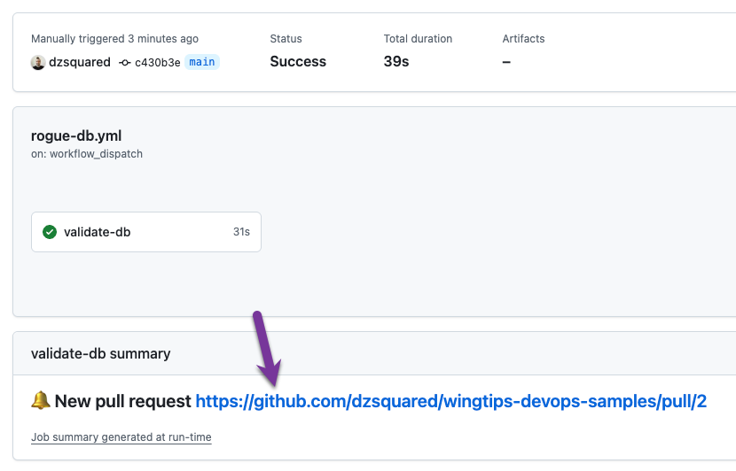
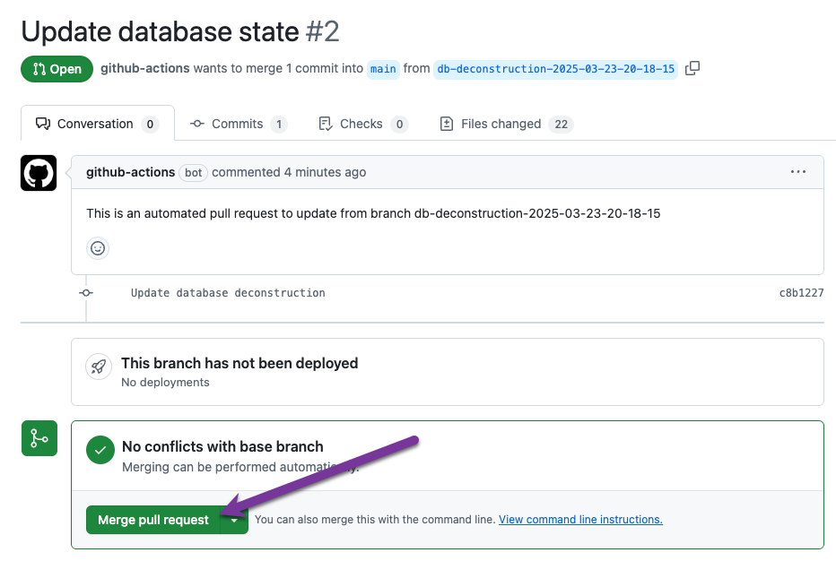

# LAB 4: Troubleshooting and Optimizing DevOps Workflows

**Overview:**
- 4.1: Creating a rollback point when the deployment is successful
- 4.2: Incorporating data cleaning pre-deployment scripts
- 4.3: Source control for a rogue database

## 4.1 Creating a rollback point when the deployment is successful

In this section, we will add a step to our deployment pipeline that gives us a rollback process in case of a failed deployment. We will archive the dacpac file on a successful deployment using a release and a git tag. The dacpac file allows us to create a dynamic rollback script that can be used to revert the database to a previous state. The git tag will give us quick visibility to the database code that matches that previous state.

1. Open the `publish.yml` file in the `.github/workflows` directory in VS Code.
2. Modify the workflow trigger to include a user input for the `DBVersion` parameter that is a required string.

```yaml
on:
  workflow_dispatch:
    inputs:
      DBVersion:
        required: true
        type: string
        description: 'Version of the database to deploy, eg 1.0.0'
```

The `DBVersion` input parameter will be added to the GitHub interface such that the semantic version of the database can be specified when the workflow is run.


3. Add a step to the end of the `Publish` job, after the `Publish SQL project` step, to create a GitHub release. We'll use the `softprops/action-gh-release` action because it facilitates the creation of a release and the uploading of Wingtips dacpac to that release.

```yaml
    - name: Archive release assets
      uses: softprops/action-gh-release@v2
      with:
        files: Wingtips/bin/Debug/Wingtips.dacpac
        tag_name: "v${{ github.event.inputs.DBVersion }}"
        name: "Wingtips v${{ github.event.inputs.DBVersion }}"
        make_latest: true
```

If a deployment were to fail, we could use the Wingtips.dacpac file from the `latest` release to revert the database to a previous state.

As time allows, run the workflow manually from the GitHub interface. You will be prompted to enter a version number for the database, something like `1.0.0`. The workflow will run and create a release with the Wingtips.dacpac file.


<details>
<summary>Expanded publish workflow</summary>

```yaml

name: Deploy SQL project

on:
  workflow_dispatch:
    inputs:
      DBVersion:
        required: true
        type: string
        description: 'Version of the database to deploy, eg 1.0.0'

permissions:
  contents: write

jobs:
  build:
    runs-on: ubuntu-22.04

    steps:
    - uses: actions/checkout@v4
    - name: Setup .NET
      uses: actions/setup-dotnet@v4
      with:
        dotnet-version: 8.0.x
    - name: Restore dependencies
      run: dotnet restore Wingtips/Wingtips.sqlproj
    - name: Build
      run: dotnet build Wingtips/Wingtips.sqlproj --no-restore
    - name: Get deployment script
      run: |
        sqlpackage /Action:Script /SourceFile:Wingtips/bin/Debug/Wingtips.dacpac /TargetConnectionString:"${{ secrets.SQL_CONNECTION_STRING }}" /OutputPath:WingtipsDeploy.sql
    - name: Upload SQL script
      uses: actions/upload-artifact@v4
      with:
        name: ReviewDeploymentScript
        path: WingtipsDeploy.sql
    - name: Generate deploy report
      run: |
        sqlpackage /Action:DeployReport /SourceFile:Wingtips/bin/Debug/Wingtips.dacpac /TargetConnectionString:"${{ secrets.SQL_CONNECTION_STRING }}" /OutputPath:WingtipsDeployReport.xml
    - name: Prettify deploy report
      shell: pwsh
      run: .github/workflows/deployReportOutput.ps1 -deployReportFile WingtipsDeployReport.xml
    - name: output step summary
      run: |
        cat deployreport.md >> $GITHUB_STEP_SUMMARY

  deploy:
    runs-on: ubuntu-22.04
    environment: ProductionDeployment
    needs: build

    steps:
    - uses: actions/checkout@v4
    - name: Setup .NET
      uses: actions/setup-dotnet@v4
      with:
        dotnet-version: 8.0.x
    - name: Restore dependencies
      run: dotnet restore Wingtips/Wingtips.sqlproj
    - name: Build
      run: dotnet build Wingtips/Wingtips.sqlproj --no-restore
    - name: Publish SQL project
      run: |
        sqlpackage /Action:Publish /SourceFile:Wingtips/bin/Debug/Wingtips.dacpac /TargetConnectionString:"${{ secrets.SQL_CONNECTION_STRING }}"
    - name: Archive release assets
      uses: softprops/action-gh-release@v2
      with:
        files: Wingtips/bin/Debug/Wingtips.dacpac
        tag_name: "v${{ github.event.inputs.DBVersion }}"
        name: "Wingtips v${{ github.event.inputs.DBVersion }}"
        make_latest: true

```

</details>


## 4.2 Incorporating data cleaning pre-deployment scripts

In this section, we will add a pre-deployment script to our SQL project such that we can incorporate data cleaning or data migration steps into our deployment process. To make the script more robust and enable executing it against multiple environments, we will also add a table to the database that tracks the version of the database.

### Track the database version in a table

Tracking the database version is enabled through a new schema `control` in the database with a table `DeployedVersions`. A new row will be added to the table with the version of the database each time a deployment occurs through a deployment script. Inserting the new version into the table is facilitated through a SQLCMD variable that is passed to the deployment.

1. Open the explorer view in VS Code and navigate to the Wingtips project.
2. Create a new folder in the Wingtips project called `control` and add a new file `control.sql` to the folder.
3. Add the following code to the `control.sql` file:

```sql
CREATE SCHEMA control;
```

4. Add a new folder to the `control` folder called `Tables` and add a new file `DeployedVersions.sql` to the `Tables` folder.
5. Add the following code to the `DeployedVersions.sql` file:

```sql
CREATE TABLE [control].[DeployedVersions] (
    [VersionNumber] NVARCHAR(50) NOT NULL,
    [DeployedOn] DATETIME2 NOT NULL DEFAULT (GETDATE()),
    [Description] NVARCHAR(255) NULL,
    CONSTRAINT [PK_DeployedVersions] PRIMARY KEY CLUSTERED ([VersionNumber])
);
```
6. Add a new folder to the `control` folder called `ScalarFunctions` and add a new file `VersionCompare_IsGreaterThan.sql` to the `ScalarFunctions` folder.
7. Add the following code to the `VersionCompare_IsGreaterThan.sql` file:

```sql
CREATE FUNCTION control.VersionCompare_IsGreaterThan
(
    @Version1 NVARCHAR(50),
    @Version2 NVARCHAR(50)
)
RETURNS BIT -- 1 when @Version1 > @Version2, 0 when @Version1 <= @Version2
AS
BEGIN
  DECLARE @greaterThan BIT = 0
  SET @greaterThan = (SELECT CASE WHEN convert(int, parsename(@Version1, 4)) > convert(int, parsename(@Version2, 4)) THEN 1  
    WHEN convert(int, parsename(@Version1, 4)) < convert(int, parsename(@Version2, 4)) THEN 0  
    ELSE CASE   
      WHEN convert(int, parsename(@Version1, 3)) > convert(int, parsename(@Version2, 3)) THEN 1  
      WHEN convert(int, parsename(@Version1, 3)) < convert(int, parsename(@Version2, 3)) THEN 0  
      ELSE CASE   
        WHEN convert(int, parsename(@Version1, 2)) > convert(int, parsename(@Version2, 2)) THEN 1  
        WHEN convert(int, parsename(@Version1, 2)) < convert(int, parsename(@Version2, 2)) THEN 0  
        ELSE CASE   
          WHEN convert(int, parsename(@Version1, 1)) > convert(int, parsename(@Version2, 1)) THEN 1  
          WHEN convert(int, parsename(@Version1, 1)) < convert(int, parsename(@Version2, 1)) THEN 0  
          ELSE 0 -- 'equal' 
    END END END END)

  RETURN @greaterThan
END
```

8. Open the SQL projects extension in VS Code.
9. Right-click on the **SQLCMD Variables** node under the Wingtips project and select **Add SQLCMD Variable**.
10. Name the variable `DBVersion` and set the default value to `0.0.0`.
11. Open the `StaticData.sql` file in the Wingtips project and add the following code to the end of the file, which inserts a row into the `DeployedVersions` table with the version of the database. The `DBVersion` SQLCMD variable is used to set the version number.

```sql
INSERT INTO control.DeployedVersions (
  VersionNumber,
  DeployedOn,
  Description
) VALUES (
  '$(DBVersion)',
  GETDATE(),
  'sample Wingtips database'
);
```

### Create a pre-deployment script that runs based on the version

1. In the SQL projects extension in VS Code, right-click on the Wingtips project and select **Add Pre-Deployment Script**.
2. Name the script `PreDeployment`.
3. Open the `PreDeployment.sql` file and add the following code to the file:

```sql
-- this predeploy script can be used to clean up data as part of the deployment

IF EXISTS (SELECT * FROM INFORMATION_SCHEMA.TABLES WHERE TABLE_NAME = 'DeployedVersions')
BEGIN

  -- if there are no deployed versions greater than 1.0.1, then we can run this cleanup section
  IF (SELECT COUNT(*) FROM control.DeployedVersions WHERE control.VersionCompare_IsGreaterThan(VersionNumber, '1.0.1') = 1) = 0
  BEGIN
    select 'data cleanup with version 1.0.1'
  END


  -- if there are no deployed versions greater than 1.2.0, then we can run this cleanup section
  IF  (SELECT COUNT(*) FROM control.DeployedVersions WHERE control.VersionCompare_IsGreaterThan(VersionNumber, '1.2.0') = 1) = 0
  BEGIN
    select 'data cleanup with version 1.2.0'
  END

END
```

Since we've added a new SQLCMD variable to the project, we need to update any deployments to pass the SQLCMD variable to the deployment.

4. Open the `build-sql2022.yml` file in the `.github/workflows` directory in VS Code.
5. The `Publish SQL project` step needs to be updated to pass the SQLCMD variable to the deployment. SqlPackage uses `/v:VariableName=value` syntax, so we will update the `Publish SQL project` step with the value of `DBVersion` from the GitHub input (`${{github.events.inputs.DBVersion}}`).

```yaml
      - name: Publish SQL project
        run: |
          sqlpackage /Action:Publish /SourceFile:Wingtips/bin/Debug/Wingtips.dacpac /TargetConnectionString:"Data Source=localhost,1433;Database=Wingtips;User ID=sa;Password=${{ secrets.CONTAINER_SQL_PASSWORD }};TrustServerCertificate=True;" /p:AllowIncompatiblePlatform=true  /v:DBVersion=${{ github.event.inputs.DBVersion }}
```

6. Open the `publish.yml` file in the `.github/workflows` directory in VS Code.
7. Locate all (three) instances of SqlPackage - **Get deploy script**, **Generate deploy report**, and **Publish SQL project**. Append the `/v:DBVersion=${{ github.event.inputs.DBVersion }}` to the end of each of the three steps. The `Publish SQL project` step should look like this:

```yaml
    - name: Publish SQL project
      run: |
        sqlpackage /Action:Publish /SourceFile:Wingtips/bin/Debug/Wingtips.dacpac /TargetConnectionString:"${{ secrets.SQL_CONNECTION_STRING }}" /v:DBVersion=${{ github.event.inputs.DBVersion }}
```


As time allows, run the deploy workflow manually from the GitHub interface. Enter a new version number, like `1.1.0`. The workflow will run and create a release with the Wingtips.dacpac file and you should be able to see the deployed version in the `DeployedVersions` table.

```sql
SELECT TOP (1000) [VersionNumber]
      ,[DeployedOn]
      ,[Description]
  FROM [control].[DeployedVersions]
```


<details>
<summary>Expanded publish workflow</summary>

```yaml

name: Deploy SQL project

on:
  workflow_dispatch:
    inputs:
      DBVersion:
        required: true
        type: string
        description: 'Version of the database to deploy, eg 1.0.0'

permissions:
  contents: write

jobs:
  build:
    runs-on: ubuntu-22.04

    steps:
    - uses: actions/checkout@v4
    - name: Setup .NET
      uses: actions/setup-dotnet@v4
      with:
        dotnet-version: 8.0.x
    - name: Restore dependencies
      run: dotnet restore Wingtips/Wingtips.sqlproj
    - name: Build
      run: dotnet build Wingtips/Wingtips.sqlproj --no-restore
    - name: Get deployment script
      run: |
        sqlpackage /Action:Script /SourceFile:Wingtips/bin/Debug/Wingtips.dacpac /TargetConnectionString:"${{ secrets.SQL_CONNECTION_STRING }}" /OutputPath:WingtipsDeploy.sql /v:DBVersion=${{ github.event.inputs.DBVersion }}
    - name: Upload SQL script
      uses: actions/upload-artifact@v4
      with:
        name: ReviewDeploymentScript
        path: WingtipsDeploy.sql
    - name: Generate deploy report
      run: |
        sqlpackage /Action:DeployReport /SourceFile:Wingtips/bin/Debug/Wingtips.dacpac /TargetConnectionString:"${{ secrets.SQL_CONNECTION_STRING }}" /OutputPath:WingtipsDeployReport.xml /v:DBVersion=${{ github.event.inputs.DBVersion }}
    - name: Prettify deploy report
      shell: pwsh
      run: .github/workflows/deployReportOutput.ps1 -deployReportFile WingtipsDeployReport.xml
    - name: output step summary
      run: |
        cat deployreport.md >> $GITHUB_STEP_SUMMARY

  deploy:
    runs-on: ubuntu-22.04
    environment: ProductionDeployment
    needs: build

    steps:
    - uses: actions/checkout@v4
    - name: Setup .NET
      uses: actions/setup-dotnet@v4
      with:
        dotnet-version: 8.0.x
    - name: Restore dependencies
      run: dotnet restore Wingtips/Wingtips.sqlproj
    - name: Build
      run: dotnet build Wingtips/Wingtips.sqlproj --no-restore
    - name: Publish SQL project
      run: |
        sqlpackage /Action:Publish /SourceFile:Wingtips/bin/Debug/Wingtips.dacpac /TargetConnectionString:"${{ secrets.SQL_CONNECTION_STRING }}" /v:DBVersion=${{ github.event.inputs.DBVersion }}
    - name: Archive release assets
      uses: softprops/action-gh-release@v2
      with:
        files: Wingtips/bin/Debug/Wingtips.dacpac
        tag_name: "v${{ github.event.inputs.DBVersion }}"
        name: "Wingtips v${{ github.event.inputs.DBVersion }}"
        make_latest: true

```
</details>

## 4.3 Source control for a rogue database

Some environments may involve a "rogue database," or a database that is being modified by another team or application in its deployed state. These changes may be necessary and valuable, but we still want to track the changes in source control and be confident that they are the right changes. In this section, we will setup a pipeline that will create a pull request (PR) anytime a change is found in the database. The changes will be presented as a SQL project so that we can leverage the same validation processes we use for our other databases.

The pipeline would ideally run on a schedule, about once a week, but for this lab we will run it manually as well.

### Enable workflows to open pull requests in the repository

For our soon-to-be-created pipeline to open pull requests in the repository, we need to enable a repository level setting to allow GitHub Actions to create and approve pull requests.

1. Go to the **Settings** tab of the repository.
2. In the left navigation pane, select **Actions**.
3. In the **General** section, scroll down to the **Workflow permissions** section.
4. Select the checkbox for **Allow GitHub Actions to create and approve pull requests**.
5. Click the **Save** button below the option.


### Create a new pipeline

1. In the `.github/workflows` folder, create a new file named `rogue-db.yml` for the new workflow "rogue database" with a `workflow_dispatch` trigger and a `schedule` trigger and permission to write to contents and pull requests in repository:

```yaml
name: rogue database

on:
  workflow_dispatch:
  schedule:
    - cron: '0 0 * * 0' # every Sunday at midnight

permissions:
  contents: write
  pull-requests: write
```

2. Add a new job to the workflow called `validate-db` that starts by checking out the repo files and setting a variable for the current timestamp. The timestamp will be used to create a new branch for any changes that are found in the database:

```yaml
jobs:
  validate-db:
    runs-on: ubuntu-22.04
    steps:
      - name: '1. Checkout repo files'
        uses: actions/checkout@v4
        
      - name: '2. Set timestamp variable'
        id: timestamp
        run: echo "branchtimestamp=$(date +'%Y-%m-%d-%H-%M-%S')" >> $GITHUB_OUTPUT
```

3. We can use the SqlPackage **extract** command to get the current state of the database as a set of *.sql* files or as a *.dacpac* file. The *.sql* files are more useful for source control, so we will use the **extract** command with the `/p:ExtractTarget` option set to `SchemaObjectType`. The output will be a folder with the name `WingtipsFromLiveDB` that contains all of the database objects in a folder structure is similar to how we would lay out a SQL project. For the SqlPackage **extract** command to succeed, we have to remove the existing `WingtipsFromLiveDB` folder if it exists. We will also add a step to create a new SQL project in the folder, which is optional.

*After we run the database extract, we remove the student.sql file from the `Security` folder. SqlPackage hashes out SQL authentication passwords, resulting in this file always having a change in the user definition.*

```yaml
      - name: '3. Reset existing database files in repo'
        run: rm -f -r WingtipsFromLiveDB

      - name: '4. Deconstruct database objects to files'
        run: |
          sqlpackage /Action:Extract /SourceConnectionString:"${{ secrets.SQL_CONNECTION_STRING }}" /TargetFile:"WingtipsFromLiveDB" /p:ExtractTarget=SchemaObjectType
          rm -f WingtipsFromLiveDB/Security/student.sql

      - name: '4b. optional - add a sqlproj to folder'
        run: |
          dotnet new install microsoft.build.sql.templates
          dotnet new sqlproj -o WingtipsFromLiveDB -tp SqlAzureV12
```

4. When we're in a UI tool like VS Code, we can see whether files have been changed from the source control view. In a pipeline, we're able to use CLI options to check for changes. We can use the `git status` command to check for changes in the `WingtipsFromLiveDB` folder. The `--porcelain` option will give us a machine-readable output, and we can use `wc -l` to count the number of lines in the output. If there are any changes, we will create a new branch and commit the changes.

```yaml
      - name: '5. Check if there is any changes with git'
        id: get_changes
        run: echo "changed=$(git status --porcelain | wc -l)" >> $GITHUB_OUTPUT
```

5. If there are changes, we will create a new branch and commit the changes. The step uses an `if` parameter to compare the `GITHUB_OUTPUT` from the `get_changes` step. There's 7 individual git commands to commit and push changes in a pipeline:
  - `git config` to set the user email
  - `git config` to set the user name
  - `git switch` to create a new branch based on the current timestamp
  - `git add` to add the changes to the staging area
  - `git commit` to commit the changes
  - `git push` to push the changes to the repository

```yaml
      # if there are changes commit and push
      - name: '6. Process changes into a git commit'
        if: steps.get_changes.outputs.changed != 0
        run: |
          git config --global user.email "dbbot@email.com"
          git config --global user.name "Database Status Bot"
          git switch -c db-deconstruction-${{ steps.timestamp.outputs.branchtimestamp }}
          git add WingtipsFromLiveDB
          git commit -m "Update database deconstruction"
          git push -u origin db-deconstruction-${{ steps.timestamp.outputs.branchtimestamp }}
```

6. The last required step is to create a pull request with the changes. We will use the `vsoch/pull-request-action` action to create a pull request from the new branch to the main branch. This action utilizes the automatic `GITHUB_TOKEN` secret on the repository, no setup is required to use the token.

```yaml
      # open pull request
      - name: '7. open a pull request'
        id: pull_request
        if: steps.get_changes.outputs.changed != 0
        uses: vsoch/pull-request-action@1.1.1
        env:
          GITHUB_TOKEN: ${{ secrets.GITHUB_TOKEN }}
          PULL_REQUEST_FROM_BRANCH: "db-deconstruction-${{ steps.timestamp.outputs.branchtimestamp }}"
          PULL_REQUEST_BRANCH: "main"
          PULL_REQUEST_TITLE: "Update database state"
```

7. Since we learned earlier about using the `$GITHUB_STEP_SUMMARY` variable to output information to the GitHub interface, we can use it here to output a summary of the changes. The summary will include a link to the pull request that was created. The `steps.get_changes.outputs.changed` variable is used to determine whether there were any changes in the database and control which summary to output.

```yaml
      - name: '8a. output summary with PR link'
        if: steps.get_changes.outputs.changed != 0
        run: |
          echo "### :bell: New pull request ${{ steps.pull_request.outputs.pull_request_url }}" >> $GITHUB_STEP_SUMMARY

      - name: '8b. output summary with no changes'
        if: steps.get_changes.outputs.changed == 0
        run: |
          echo "### :tada: No database drift detected" >> $GITHUB_STEP_SUMMARY
```


<details>
<summary>Complete rogue DB workflow</summary>

```yaml
name: rogue database

on:
  workflow_dispatch:
  schedule:
    - cron: '0 0 * * 0' # every Sunday at midnight

permissions:
  contents: write
  pull-requests: write

jobs:
  validate-db:
    runs-on: ubuntu-22.04
    steps:
      - name: '1. Checkout repo files'
        uses: actions/checkout@v4
        
      - name: '2. Set timestamp variable'
        id: timestamp
        run: echo "branchtimestamp=$(date +'%Y-%m-%d-%H-%M-%S')" >> $GITHUB_OUTPUT

      - name: '3. Reset existing database files in repo'
        run: rm -f -r WingtipsFromLiveDB

      - name: '4. Deconstruct database objects to files'
        run: |
          sqlpackage /Action:Extract /SourceConnectionString:"${{ secrets.SQL_CONNECTION_STRING }}" /TargetFile:"WingtipsFromLiveDB" /p:ExtractTarget=SchemaObjectType
          rm -f WingtipsFromLiveDB/Security/student.sql

      - name: '4b. optional - add a sqlproj to folder'
        run: |
          dotnet new install microsoft.build.sql.templates
          dotnet new sqlproj -o WingtipsFromLiveDB -tp SqlAzureV12

      - name: '5. Check if there is any changes with git'
        id: get_changes
        run: echo "changed=$(git status --porcelain | wc -l)" >> $GITHUB_OUTPUT

      # if there are changes commit and push
      - name: '6. Process changes into a git commit'
        if: steps.get_changes.outputs.changed != 0
        run: |
          git config --global user.email "dbbot@email.com"
          git config --global user.name "Database Status Bot"
          git switch -c db-deconstruction-${{ steps.timestamp.outputs.branchtimestamp }}
          git add WingtipsFromLiveDB
          git commit -m "Update database deconstruction"
          git push -u origin db-deconstruction-${{ steps.timestamp.outputs.branchtimestamp }}

      # open pull request
      - name: '7. open a pull request'
        id: pull_request
        if: steps.get_changes.outputs.changed != 0
        uses: vsoch/pull-request-action@1.1.1
        env:
          GITHUB_TOKEN: ${{ secrets.GITHUB_TOKEN }}
          PULL_REQUEST_FROM_BRANCH: "db-deconstruction-${{ steps.timestamp.outputs.branchtimestamp }}"
          PULL_REQUEST_BRANCH: "main"
          PULL_REQUEST_TITLE: "Update database state"

      - name: '8a. output summary with PR link'
        if: steps.get_changes.outputs.changed != 0
        run: |
          echo "### :bell: New pull request ${{ steps.pull_request.outputs.pull_request_url }}" >> $GITHUB_STEP_SUMMARY

      - name: '8b. output summary with no changes'
        if: steps.get_changes.outputs.changed == 0
        run: |
          echo "### :tada: No database drift detected" >> $GITHUB_STEP_SUMMARY

```

</details>


### Test the workflow

To test this workflow, we need to run it once to capture the current state of the database, then make a change to the database and run it again.

1. In the GitHub interface, navigate to the **Actions** tab and select the **rogue database** workflow.
2. Click the **Run workflow** button to run the workflow manually.
3. Once the workflow has completed, click on the **New pull request** link in the summary to view the pull request that was created.



4. This initial pull request contains the entire state of the database written to the `WingtipsFromLiveDB` folder. Merge the pull request to the main branch of the repository.



5. Once the pull request is merged, delete the temporary db-deconstruction branch that was created.

### Make an "off-process change" to the database

1. In VS Code, open the **SQL Server** extension view (object explorer) and connect to the Azure SQL Database.
2. Expand the **Databases** node and locate the Wingtips database. Right-click on the database and select **New Query**.
3. In the query window, run the following SQL code:

```sql
CREATE INDEX IX_Customers_PostalCode ON Customers (PostalCode);
GO

CREATE VIEW dbo.MusicVenues
AS
SELECT v.VenueId
  , v.VenueName
  , v.VenueType
  , v.AdminEmail
  , v.AdminPassword
  , v.PostalCode
  , v.CountryCode
  , v.RowVersion
FROM dbo.Venues v
LEFT JOIN dbo.VenueTypes vt
ON v.VenueType = vt.VenueType
WHERE vt.EventTypeShortName IN ('Concert', 'Session', 'Opera')
GO
```

4. Click the **Execute** button to modify the database.
5. In the GitHub interface, navigate to the **Actions** tab and select the **rogue database** workflow.
6. Click the **Run workflow** button to run the workflow manually.
7. Once the workflow has completed, click on the **New pull request** link in the summary to view the pull request that was created from the ad-hoc changes we just made to the database.
8. This time, the pull request contains only the changes that were made to the database. Go to the **Files changed** tab to see the changes that were made to the database. There are two files that are different:
  - `WingtipsFromLiveDB/dbo/Views/MusicVenues.sql` - new file for the new view that was created
  - `WingtipsFromLiveDB/dbo/Tables/Customers.sql` - the table definition for the Customers table was modified to add the new index


9. Merge the pull request to the main branch of the repository.
10. Once the pull request is merged, delete the temporary db-deconstruction branch that was created.

If we were actively developing this database further, we would integrate this workflow into our other CI/CD processes. For example:
- We could use code analysis check the changes for suggested revisions
- We could use SqlPackage to deploy these changes to our other test/staging/production environments
- We could create unit tests to validate the functionality of the database after the changes were made

The schema compare graphical UIs in Visual Studio and Azure Data Studio are also good tools to visualize the changes that were made to the database and bring these changes back into a SQL project. This workflow provides a way to automatically notice and capture changes to a database that is being modified outside of the normal development process, but additional graphical tools are available to help us understand and manage these changes.
